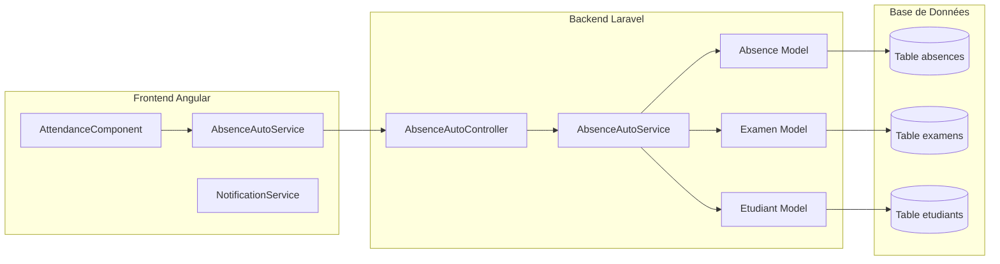
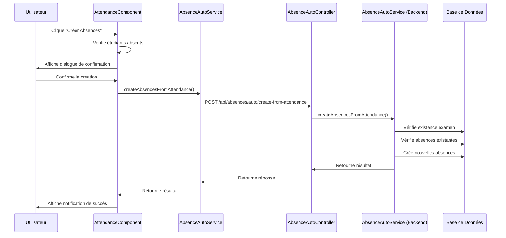
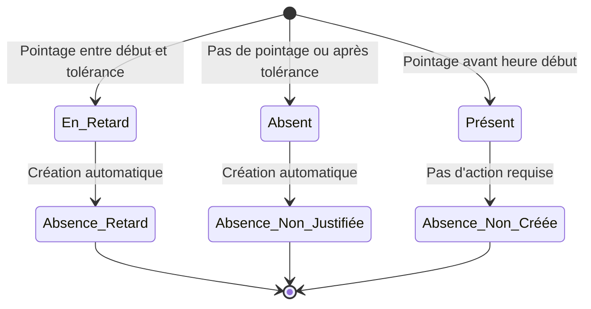
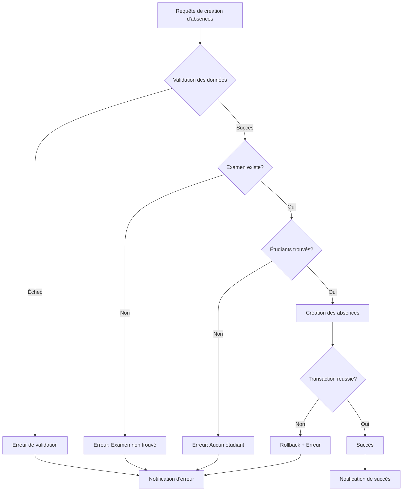
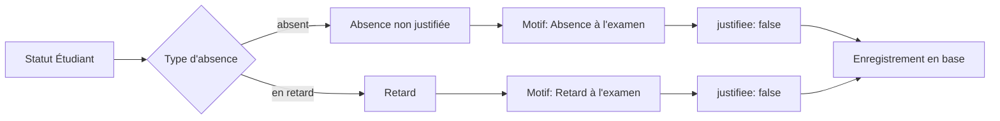
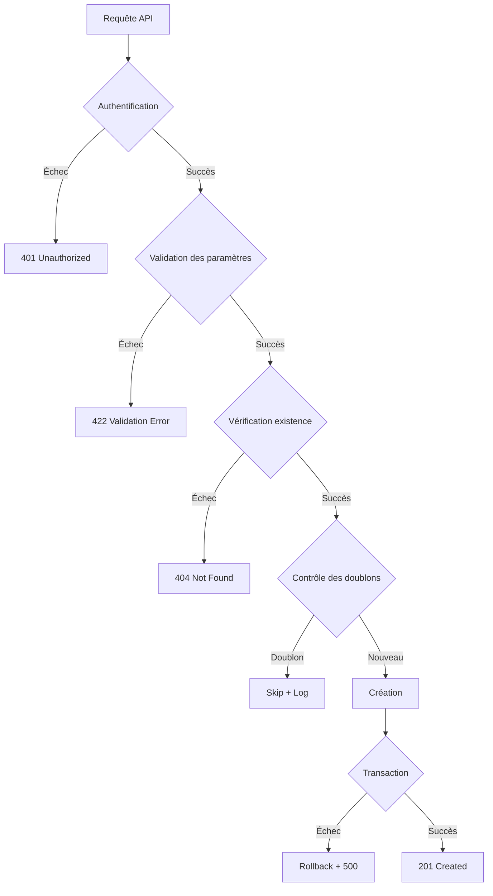
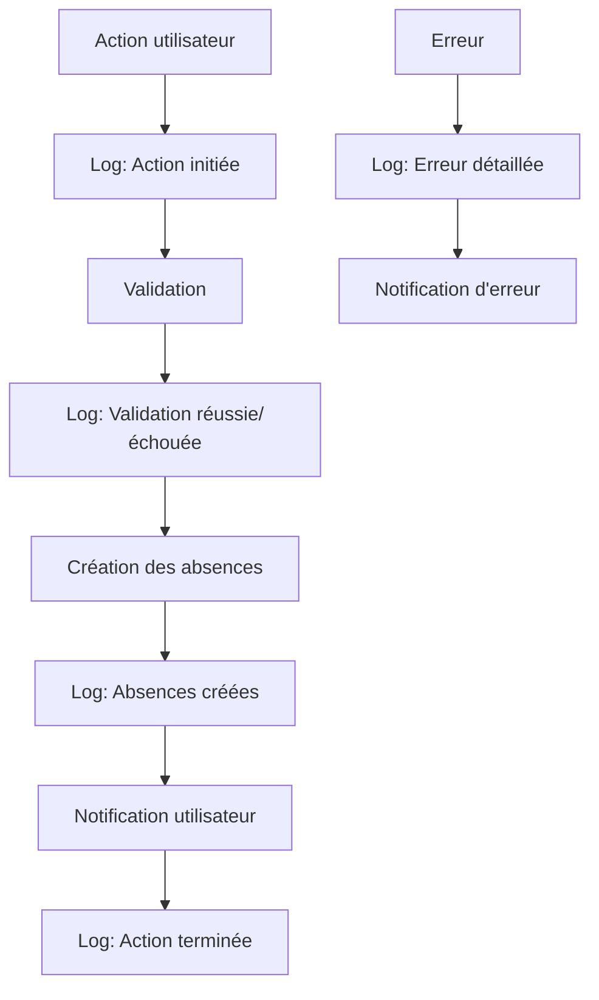
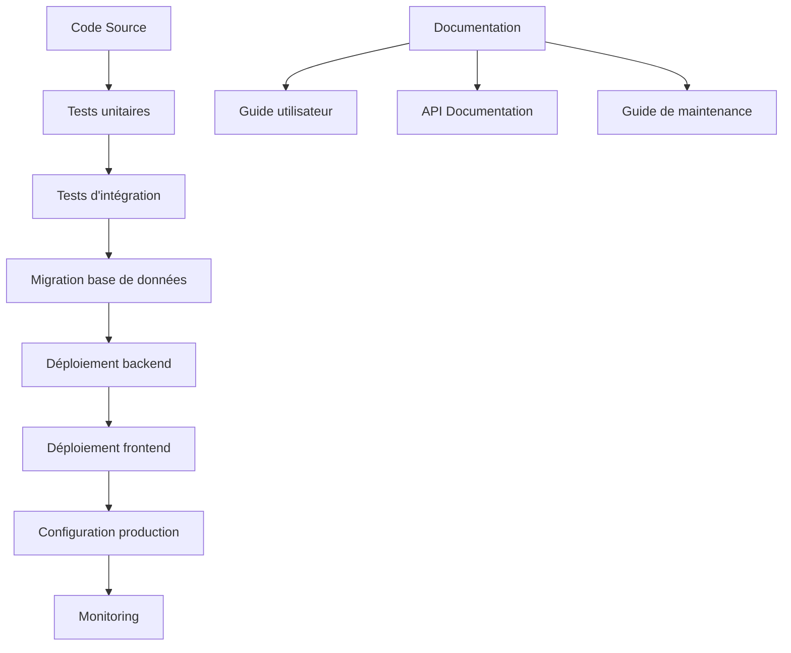

# Diagramme de Flux - Système de Création Automatique des Absences

## Flux Principal

```mermaid
graph TD
    A[Interface d'Attendance] --> B{Étudiants absents/en retard?}
    B -->|Oui| C[Bouton "Créer Absences" actif]
    B -->|Non| D[Bouton "Créer Absences" désactivé]
    
    C --> E[Clic sur le bouton]
    E --> F[Dialogue de confirmation]
    F --> G{Utilisateur confirme?}
    G -->|Oui| H[Appel API createAbsencesFromAttendance]
    G -->|Non| I[Annulation]
    
    H --> J[Service AbsenceAutoService]
    J --> K[Validation des données]
    K --> L{Données valides?}
    L -->|Oui| M[Création des absences en base]
    L -->|Non| N[Retour d'erreur]
    
    M --> O[Notification de succès]
    O --> P[Fermeture du dialogue]
    
    N --> Q[Notification d'erreur]
    Q --> R[Affichage de l'erreur]
```

## Architecture du Système



## Flux de Données



## États des Étudiants



## Gestion des Erreurs



## Types d'Absences



## Sécurité et Validation



## Monitoring et Logs



## Configuration et Déploiement


